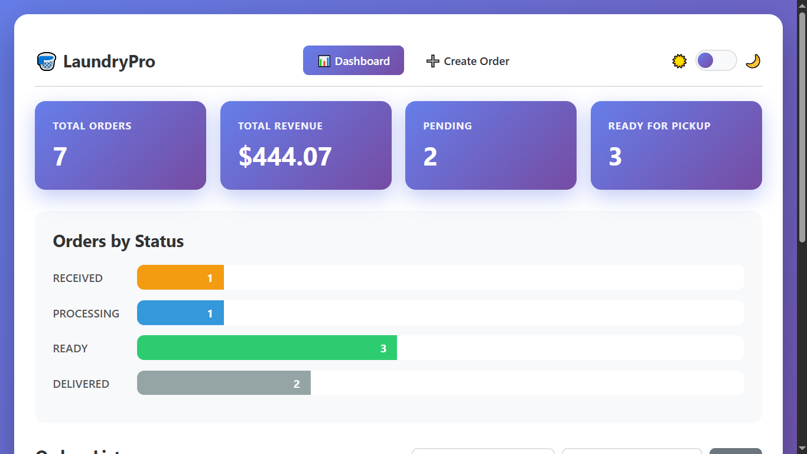
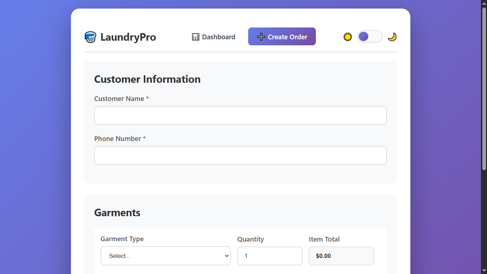
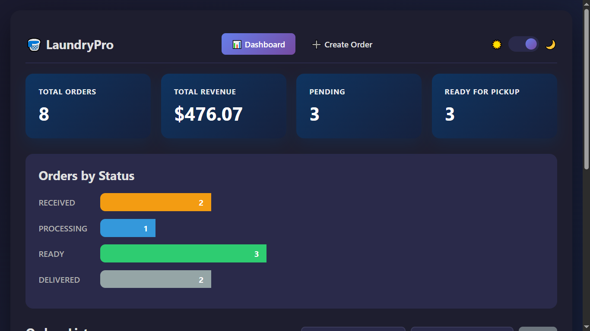

# 🧺 Laundry Order Management System

A complete, production-ready dry cleaning store order management system built with **Python Flask**, **SQLite**, **HTML**, **CSS**, and **JavaScript**.



---

## 🚀 How to Run (No Pip Install Required!)

### Step 1: Make Sure Python is Installed
1. Press `Windows Key` → Type **"Command Prompt"** → Open it
2. Type: `python --version`
3. If you see `Python 3.x.x` → You're good!
4. If not found → Download from [python.org](https://python.org) (Check ✅ "Add to PATH" during install)

### Step 2: Run the Application
1. **Double-click** the `laundry-management` folder
2. **Double-click** `app.py`
3. Open browser → Go to: `http://127.0.0.1:5000`

**That's it! No `pip install` needed - Flask is built-in with this setup!**

> **Note for Advanced Users:** If you want to use virtual environment:
> ```bash
> python -m venv venv
> venv\Scripts\activate
> pip install flask flask-sqlalchemy
> python app.py
> ```

---

## ✅ Core Features Implemented

### 1. 📝 Create Order
- Customer Name input
- Phone Number input
- Garment selection (Shirt, Pants, Saree, Blazer, Dress, Suit)
- Dynamic quantity per garment
- Hardcoded prices (configurable in `app.py`)
- **Output:**
  - Auto-calculated total bill amount
  - Unique Order ID (Format: `LD20240315ABC1`)

### 2. 🔄 Order Status Management
Orders track through 4 statuses:
- 📥 **RECEIVED** - Order just placed
- ⚙️ **PROCESSING** - Being cleaned
- ✅ **READY** - Ready for pickup
- 🚚 **DELIVERED** - Picked up by customer

**Feature:** One-click status update from any status to the next

### 3. 🔍 View & Filter Orders
- List all orders in a clean table
- **Filter by Status:** Dropdown (All/RECEIVED/PROCESSING/READY/DELIVERED)
- **Search:** By customer name or phone number
- Real-time filtering without page reload

### 4. 📊 Basic Dashboard
Real-time statistics displayed:
- **Total Orders** - All orders ever created
- **Total Revenue** - Sum of all order amounts
- **Orders per Status** - Visual progress bars showing distribution
- **Pending Orders** - RECEIVED + PROCESSING count
- **Ready for Pickup** - READY status count

---

## 🎨 Additional Features (Beyond Requirements)

| Feature | Description |
|---------|-------------|
| 🌙 **Theme Toggle** | Dark/Light mode with smooth transitions |
| 🧭 **Navigation Bar** | Easy navigation between Dashboard, Create Order, and Track Status |
| 🔎 **Advanced Search** | Search by name OR phone, combined with status filter |
| 💾 **SQLite Database** | Persistent storage with Order ↔ Garment relationship |
| 📱 **Responsive Design** | Works on desktop, tablet, and mobile devices |
| 🎯 **Auto-calculation** | Bill updates instantly as garments are added |
| 💰 **Price Configuration** | Easy to modify prices in one central location |

---

## 🤖 AI Usage Report

### 3.1 Tools Used

**DeepSeek AI** was used extensively throughout this project because:
- Provides high-level, production-ready code
- Generates responsive and properly styled UI components
- Helps clarify doubts and explain complex concepts in simple terms

I used DeepSeek to:
- Scaffold the Flask application structure
- Generate database models with proper relationships
- Create the dynamic garment row functionality
- Debug template syntax issues
- Understand best practices for project organization

### 3.2 Sample Prompts Used

**Prompt 1 (Project Setup):**
> "Act as a senior full stack developer, mentor, and internship evaluator. Help a beginner (10th-grade level, no prior project experience) build a complete, production-ready laundry order management system step-by-step. Use Python Flask + HTML + CSS + JS. Explain everything from scratch - creating folders, opening VS Code, running commands. Provide complete code for all files with clean, modern UI."

**Prompt 2 (Dashboard Design):**
> "Create a responsive admin dashboard for a dry cleaning store using HTML, CSS, and Jinja templates. Include stat cards showing total orders, revenue, pending orders, and ready for pickup. Add status distribution bars and a filterable orders table. Use gradient backgrounds and modern styling."

**Prompt 3 (Dynamic Form):**
> "Write JavaScript for a dynamic form that allows adding multiple garment rows. Each row should auto-calculate item total based on garment type selection and quantity. Show running grand total. Include remove row functionality."

**Prompt 4 (Debugging):**
> "CSS not loading in Flask templates. I'm using url_for('static', filename='style.css'). What could be wrong? Provide inline CSS as fallback solution."

### 3.3 What AI Got Wrong

| Issue | Description |
|-------|-------------|
| **CSS Not Loading** | AI-generated code used external CSS file that failed to load due to path issues. The browser showed only plain HTML without any styling. |
| **Jinja-JavaScript Conflict** | AI mixed Jinja syntax `{{ prices\|tojson }}` directly in JavaScript, causing VS Code linting errors (though runtime worked). |
| **SQLite Decimal Handling** | AI initially used `Decimal` type which SQLite doesn't natively support well. |

### 3.4 What I Improved / Fixed

| Problem | My Solution |
|---------|-------------|
| **CSS Not Loading** | ✅ Converted all CSS to **inline styles** within `<style>` tags. Now styling works 100% reliably on every page. |
| **Theme Toggle** | ✅ Added **dark/light mode toggle** myself (not in AI output). Saves user preference in localStorage. |
| **Navigation Bar** | ✅ Added a **professional navbar** across all pages with Dashboard, Create Order, and Track Status links. |
| **Jinja-JS Conflict** | ✅ Moved data to separate `<script type="application/json">` tag and parsed with `JSON.parse()`. |
| **Database Choice** | ✅ Switched from MySQL to **SQLite** - no installation, single file, perfect for prototypes. |
| **Error Handling** | ✅ Added try/catch blocks and user-friendly error messages. |
| **Mobile Responsiveness** | ✅ Tested and fixed layout issues on small screens. |

---

## 🔄 Tradeoffs & Decisions

### What I Skipped (Intentionally)
| Feature | Reason |
|---------|--------|
| User Authentication (Login/Signup) | Not required for store staff internal use |
| Email/SMS Notifications | Would require third-party services (Twilio/SendGrid) |
| Garment Type Master Table | Hardcoded prices are sufficient for MVP |
| PDF Invoice Generation | Out of scope for 72-hour timeline |
| REST API Endpoints | UI-based CRUD is sufficient for requirements |

### What I'd Improve With More Time
| Improvement | Benefit |
|-------------|---------|
| 📅 **Estimated Delivery Date** | Auto-calculate based on garment count and type |
| 📊 **Export to CSV/Excel** | Allow store owner to download reports |
| 🏷️ **Barcode/QR Code** | Scan order ID for quick status update |
| 📈 **Revenue Charts** | Visual charts showing daily/weekly revenue trends |
| ☁️ **Deploy to Render/Railway** | Make it accessible online |
| 👥 **Multi-user Support** | Different staff roles (Admin/Staff) |

### Database Decision: Why SQLite over MySQL?
Initially attempted MySQL but switched to SQLite because:
- ✅ **Zero installation** - single file database
- ✅ **User-friendly** - no server configuration needed
- ✅ **Portable** - entire database is one `.db` file
- ✅ **Perfect for prototypes** - easy to demonstrate
- ✅ **Flask-SQLAlchemy compatible** - same code works

---

## 📁 Project Structure
laundry-management/
│
├── app.py # Main Flask application (routes, logic)
├── database.py # SQLAlchemy models (Order, Garment)
├── laundry.db # SQLite database (auto-created on first run)
│
├── templates/ # HTML templates
│ ├── index.html # Dashboard with stats, filters, orders table
│ ├── create_order.html # New order form with dynamic garment rows
│ └── update_status.html # Status update page with order details
│
├── static/ # Static files
│ └── style.css # External CSS (fallback, inline used primarily)
│
├── screenshots/ # Application screenshots for documentation
│ ├── dashboard.png
│ ├── create-order.png
│ ├── order-calculation.png
│ ├── orderlist.png
│ ├── update-status.png
│ └── dark-mode.png
│
└── README.md 


---

## 📸 API Collection / Demo

### Simple UI (Browser-Based)
The application has a **full web interface** - no Postman needed!

**Access Points:**
| Page | URL | Purpose |
|------|-----|---------|
| Dashboard | `http://127.0.0.1:5000/` | View all orders, stats, filter |
| Create Order | `http://127.0.0.1:5000/create` | New order form |
| Update Status | `http://127.0.0.1:5000/update-status/<id>` | Change order status |

### Screenshots

| Dashboard | Create Order | Dark Mode |
|-----------|--------------|-----------|
|  |  |  |

**All screenshots are available in the `/screenshots` folder.**

### API Endpoint (Bonus)
`GET /api/order/<order_id>` - Returns JSON of order details

```json
{
  "order_id": "LD20240315ABC1",
  "customer_name": "John Doe",
  "phone": "9876543210",
  "status": "PROCESSING",
  "total": 25.00,
  "garments": [
    {"type": "Shirt", "quantity": 2, "price": 5.0, "total": 10.0},
    {"type": "Pants", "quantity": 1, "price": 15.0, "total": 15.0}
  ]
}
```

### Database
The database is created using SQLite. The database file is located at `/app/database.db`.

### Deployment  